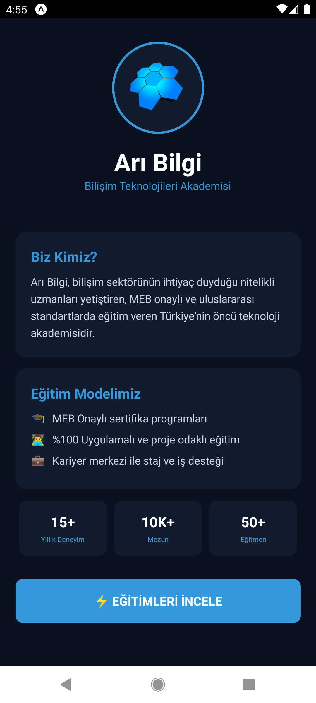
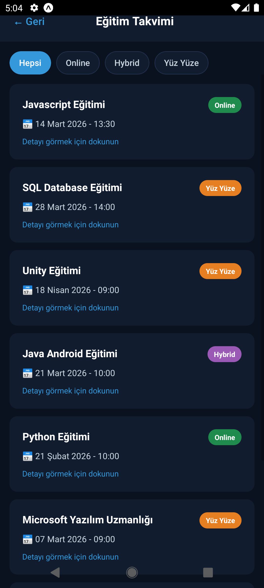
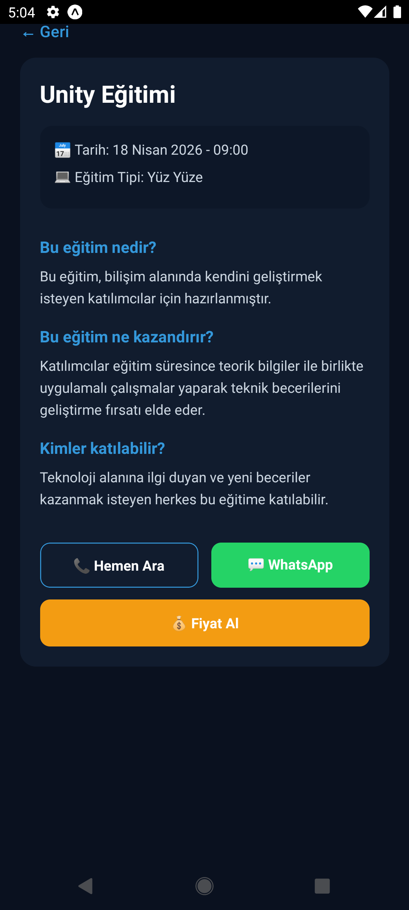
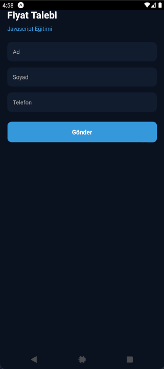

# 📱 Eğitim Takvimi Mobil Uygulaması

Bu proje React Native kullanılarak geliştirilmiş bir **Eğitim Takvimi Mobil Uygulamasıdır**.  
Uygulama, kullanıcıların planlanan eğitimleri görüntülemesini, detaylarını incelemesini ve eğitim hakkında iletişime geçmesini sağlar.

Proje React.js & React Native eğitimi kapsamında geliştirilmiştir.

---

# 🚀 Özellikler

Uygulamada aşağıdaki özellikler bulunmaktadır:

- 📋 Eğitim listeleme
- 🔍 Eğitim filtreleme (Online / Hybrid / Yüz Yüze)
- 📅 Eğitimleri tarihe göre sıralama
- 📖 Eğitim detay sayfası
- 💬 WhatsApp üzerinden iletişim
- 📞 Telefon ile arama
- 💰 Fiyat talep formu
- ☁️ Firebase Firestore veritabanı entegrasyonu
- 📝 Kullanıcı talep kayıtlarının veritabanına kaydedilmesi

---

# 🛠 Kullanılan Teknolojiler

Bu projede aşağıdaki teknolojiler kullanılmıştır:

- React Native
- Firebase Firestore
- React Navigation
- JavaScript

## 📸 Uygulama Görselleri

### Ana Sayfa

### Eğitim Listesi

### Eğitim Detay

### Fiyat Talep Formu

